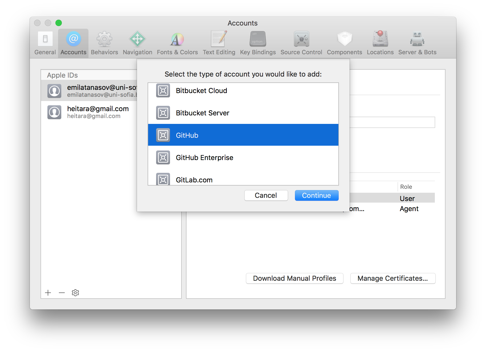
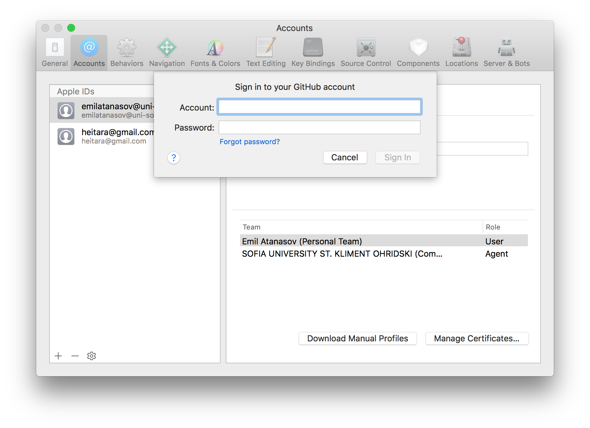
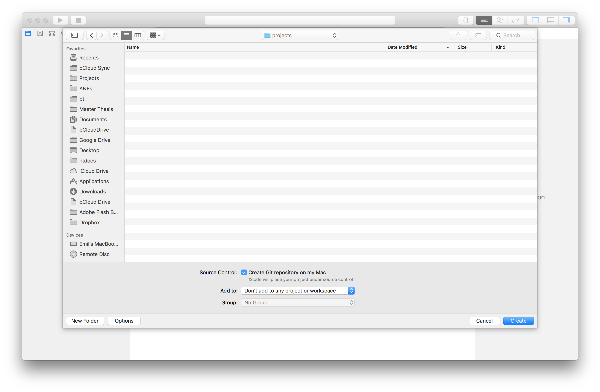
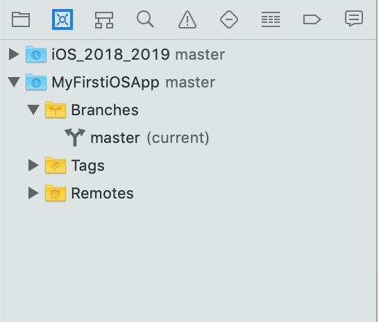
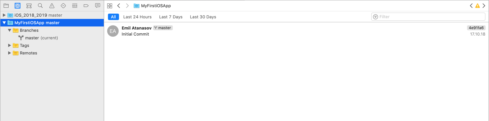
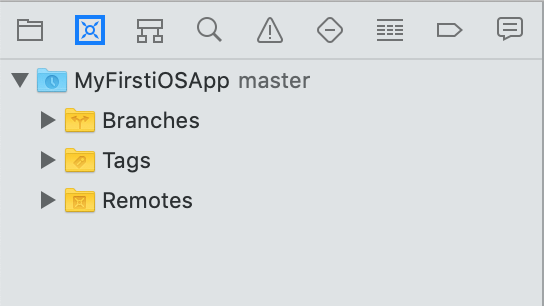
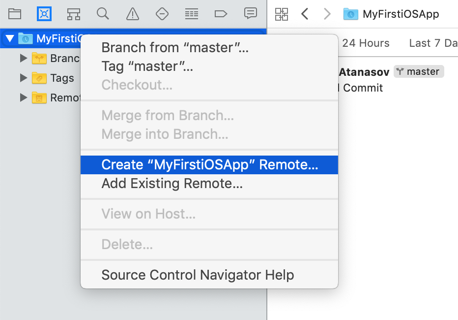
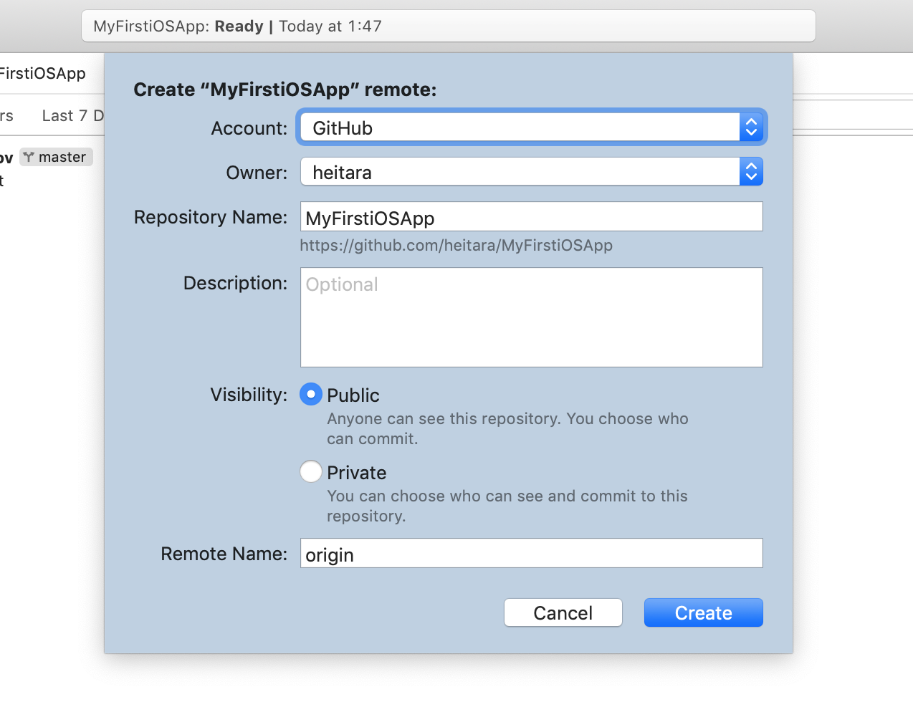

# Git

Git e децентрализирана система за контрол на версиите. Тя се използва за съхраняване на програния код и координирането на съвместната работа между различни хора. Основното приложение на Git е за управлението на кода на софтуерните приложения, но в общия случай системата може да се използва за следене на различни версии на множество файлове. Git води началото си от 2005 год. и е разработка на Linus Torvalds. Ние ще използваме Git, за да съхраняваме проектите си и нашата работа в прогрес върху тях. Това ще ни позволи да се връщаме към предходни версии и да разработваме нови функционалности съвместно с други разработчици. 

Децентрализираната природа на Git се изразява в това, че всеки един от участниите може да заеме водеща роля по всяко едно време, т.е. централизиран модел и няма зависимост от централно звено (сървър). За разлика от децентрализираната система, каквато е Git, централизираният модел (SVN) зависи от сървъра и ако сървърът не работи или връзката към него се прекъсне, системата се разпада.

# Github

Github е място, където свободно можем да използваме Git за проекти с отворен код. Всъщност, Github е едно от най-популярните места за публикуване и съхранение на отворен код в момента. Компанията предоставя както платени, така и безплатни планове за съхранение (хостване) на проекти чрез Git. От 2018 год. Github е собственост на  Microsoft.  В Github може да създадете ваш профил и да поддържате набор от ваши проекти, които да показват вавшето ниво. Доста често Github се използва като средство за намиране на кадри, затова е хубаво да имаме добри проекти там. За съвременните компании разработката на open-source е важна част от тяхното развитие. 

Това, че даден проект е публикуван в Github, обаче, не означава, че той автоматично става достъпен безплатно. Хората имат достъп до кода, но нямат правото да го ползват, освен ако това не е изрично уредено с лиценз. Лицензът, под който се разпространява даден код, определя начинът, по който може да се използва в други проекти. Например, ако даден проект е под лиценз GPL, той не може пряко да участва в друг комерсиален продукт, защото GPL-лицензът задължава всеки, който използва части от този код, да разпространява напълно безплатно продукта. Преди да качите Вашия проект, помислете какъв лиценз би пасвал най-добре. Когато ползвате чужди проекти, първо трябва да съобразите лицензите им. Лицензи, които са благоприятни за ползване, са Apache, MIT, BSD, разновидности на Creative commons.

# Git интеграция в Xocde

След като се запознахме с Xocde (Версия 9+) трябва да знаем, че можем да извършваме всички основни действия като създаване на репозиторита (хранилища), pull, push, commit, tags, branch-ове и др. директно от Xcode. Нека да разгледаме интеграцията накраткто. 

Първата основна стъпка е да си добавим Github-account от Настройки (Preferences). Отиваме на секцията за акаунти (Accounts tab) и натискаме +. 

После трябва да въведем информацията за нашия акаунт в Github. Github предоставят безплатен план, които можете да използвате за да качвате проекти с отворен код.

Когато създаваме нов проект можем да създадем и git репозитори(хранилище). Това ще ни позволи да публикуваме проекта в github по-късно.

Може да управлявате интеграцията с гит от втория таб в левия панел на Xcode. Той изглежда така:

В централния панел има повече информация за проекта и история на промените.

Ако искате да публикувате проект в github, тогава отваряте панела за работа с гит (втория панел от ляво). Там трябва да присъства текущия проект. 
Ако той липсва може да го създадете от `Source Control` -> `Create Git Repositories...` Then click on `Create` button. Сега проекта вече трябва да се вижда в левия панел.

Десен клик над проекта и ще се покажа меню.

От това меню избираме `Create "MyFirstiOSApp" Remote`. Тук името на проекта ще е различно. Показва се следни прозорец, където трябва да се попълнят необходимите данни.

Можете да прочете повече информация за git интеграцията в Xcode [тук](https://help.apple.com/xcode/mac/current/#/dev3fd7ccc7a).
