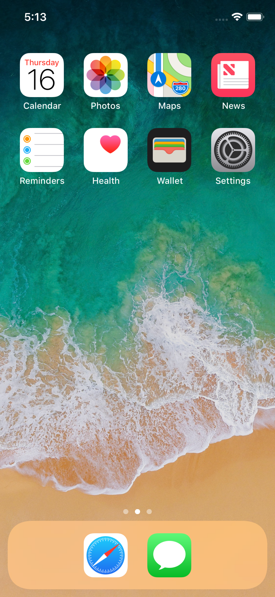

# Xcode

Xcode включва всичко необходимо за разработката на приложения за всички платформи на Apple (iOS,watchOS,tvOS,macOS).
Средата стой в центъра на разработването на софтуер за платформите на Apple.
В нея се случва целия процес около създаването на една native апликация. От създаването на проекта, изграждането на интерфейса,добавянето на ресурси,библиотеки,функционалности и имплементирането на логиката и писането на кода в приложението, до пакетирането и пускането му в App Store. Всичко това се случва в Xcode.

Различните функционалности и възможности на приложението, които се предоставят от Apple като [Game Center](https://developer.apple.com/game-center/ "Apple Game Center") и [Wallet](https://developer.apple.com/wallet/ "Wallet") могат да бъдат активирани със единствен клик или промяна в .plist-a на проекта благодарение на факта, че Xcode комуникира със сайта за [програмисти на Apple "Apple Developer"](https://developer.apple.com).
В Xcode може да пишем код на Swift,Objective-C,C и C++.

Можете безплатно да свалите Xcode безплатно от [App Store](https://itunes.apple.com/bg/app/xcode/id497799835?mt=12 "Xcode App Store"). При първо отваряне на средата ще Ви бъде предложено да инсталирате "Xcode command line tools", пакет от основните услуги, необходими за разработката на софтоер за системите на Apple. 
<!--
 

-->

## Навигиране в Xcode

1. **Текстови редактор** - осноновният компонент за разработка на софтуер;
2. **Навигатор** - чрез него програмистите лесно могат да навигират през файловете на проекта, тестовете, грешките в компилатора, breakpoints и така нататък;
3. **Помощна зона** - тук можете да намерите описание на файла, който сте избрали и документация за избраната променлива или функция;
4. **Дебъг зона** - използва се по време на дебъгване;
5. **Библиотека** - тук ще намерите: библиотека с шаблони; библиотека с code snipets, към която можете да добавите и свои snippet-и (отрязъци от код); библиотека с обекти; медиа библиотека, която ви дава бърз достъп до картинки и друга медиа, добавени в проекта.

## Assistant Editor

Assistant Editor разделя екрана на Xcode на две части.Програмистите могат да избират ръчно кои файлове да бъдат визуализиране или да се възползват от автоматичния избор, който средата определя спрямо основния избран файл от лявата страна на екрана.Xcode определя най-подходящия според него файл,който да покаже във второстепенния прозорец свързан със контекста на първия. 
Например ако от лявата страна е отворен файл от Interface Builder-a отдясно ще се покаже автоматично класа, който е зададен като представител на интерфейсния файл. От друга страна ако сме отворили .h (интерфейсния файл) на един клас, отдясно ще видим .m (имплементационния) файл на същия клас.

## Jump bar

За улеснение на програмистите, когато кликнете върху всяко от нивата на пътя до текущия файл, можете да видите всички файлове или функции, които се съдържат съответно в директорията или файла. Ако започнете да пишете по клавиатурата автоматично се влиза в режим на търсене с автоматично допълване и филтриране.
Това е изключително полезно, когато търсим нещо конкретно в големи директории или файлове.
## Open Quickly

Open Quickly е много бърз и удобен начин да отворите файл като го търсите по име без да го търсите във структурата на проекта. Просто натискате Cmd+Shift+O и се отваря диалога Open Quickly. Като резултатите се филтрират много бързо и спрямо това което пишете. С тази функционалност може да се отварят както файлове, така и функции във файловета.

## Xcode IDE

### Source Editor

<!--Xcode Source Еditor разполага с много добър code completion,code folding, syntax, h-->
Write code using a professional editor with advanced code completion, code folding, syntax highlighting, and message bubbles that display warning, errors, and other context-sensitive information inline with your code.

### Version Editor

Xcode’s предлага Version editor.Той показва списък от направените промени като показва автора, датата и реда на промените. Графично показва направените промени във времето и също така може да се сравняват всеки две различни версии на един файл от момента, в който е добавен под система за контрол на версиите.
Xcode поддържа пълна Git и Subversion интеграция.

### Interface Builder Built In

Xcode предлага изключително удобен и лесен начин за строене на интерфейса на приложенията наречен Interface Builder (IB). Почти всичко в него може да бъде управлявано само с Drag and Drop. Просто отваряте списъка с графични обекти "влачите" ги в текущия екран, след което лесно можете да добавите функция или референция към графичния Ви обект в класа който отговаря(притежава) текущия екран. Обектите интуитивно се подреждат, наместват и визуализират в IB, почти по същия начин, по който ще изглеждат в приложението. Виждате резултата и голяма част от изгледа преди да сте качили приложението на устройство или симулатор.
Всичко, което може да се направи в Interface Builder, може да бъде изпълнено и с код, но е по ненагледно, често по-бавно и трудоемко. (Обратното не е в сила).
Едно от най-силните качества на IB без което почти никой съвременен апп не може е AutoLayout Engine. С две думи това е интерфейсен инструмент на платформата,който помага на програмиста да напасне интерфейса за различните размери на екрана, ориентации и да определи поведението му в различни ситуации като дори му предоставя възможността да променя тези правила по-късно в кода.

### Simulator

Със iOS SDK, Xcode може да билдва,инсталира,стартира и дебъгва приложенията на симулатор.На разположение на програмиста са емулатори на всички текущи устройства на Apple като дори могат да бъдат стартирани под различни версии на iOS.По-стари за по-лесна поддръжка на предишните версии, текущите актуални или дори още неофициални бета версии. Това дава голяма свобода и гъвкавост при създаването и още повече в поддръжката на едно приложение.
Симулаторите на Xcode почти напълно предоставят функционалностите на физическо устройство.

### Compilers

В основата на компилацията на Xcode стой LLVM. Със него кода се компилира много бързо като е оптимизиран от Apple да предостави невероятно бързи приложения,специално настроени за процесорите на iPhone,iPad и Mac.
Поради тази причина устройствата на Apple надминават по производителност такива на конкурентни фирми, които имат много повече ресурс от към процесорна мощност и оперативна памет.

### Graphical Debugger

Можете да влезете в дебъг състояние дори за интерфейса на приложението Ви. Просто паузирате изпълнението на програмата в определен момент и наблюдавата структурата, съдържанието и данните на обектите които се намират на екрана в момента.

### Continuous Integration

Xcode Server  управлява ботове които продължително да билдват, анализират, тестват и дори архивират Вашите Xcode проекти. Xcode IDE конфигурира тези ботове, анализира билдовете и резултатите от тестовете и може да проследи каква е причината, поради която се е счупил билда.

### Asset Catalog

Asset catalog съдържа и управлява изображенията на приложението. Като ги групира по резолюция Xcode компилира финалния продукт по най-ефективния начин от страна на памет. App Thinning 
<!--# OpenGL Frame Capture
Press a single button to capture a complete representation of the current OpenGL frame from an iOS device. Xcode displays the shader information, and can visually construct how the frame was assembled within the Xcode debugger.-->

### Complete Documentation

Лесен и бърз достъп до документацията на системните интерфейси,методи и класове през Help или Documentation менютата.Като във тях има и референция към подробната документация на системните API-та.

### Live Issues

Xcode предупреждава или блокира компилация още преди опит за такава когато засече грешен синтаксис или запис в кода.

### Fix-it

Когато направите грешка при писане на кода, ако Xcode успее да я обработи, автоматично ще Ви предупреди и ще Ви предложи варианти за корекция, които могат да бъдат повече от един и в зависимост от ситуацията на програмиста се оставя да реши каква промяна да предприеме. Също така при наличието на такова предупреждение може да се направи корекцията с проста клавишна комбинация без никакво допълнително усилие.

### Quick Help

При автоматичното допълване на кода виждате кратко описание на текущия фокусиран метод или клас, като можете лесно да видите и по-подробна информация чрез задържане на ⌘ или ⌥ и клик върху кода.

### XCTest Framework

Вградена библиотека за юнит тестове, които да тестват функционалността на приложенията като тя може да бъде използвана и на симулаторите.

### Static Analysis

Статичния анализ на кода дава възможност на програмиста да открие скрити проблеми или бъгове в кода преди да се стигне до тях при тестване. Анализа дава възможност да се предотватят грешки, които са много трудни или дори невъзможни за възпроизвеждане.

### Instruments

Xcode разполага с широк набор от инструменти за анализ на поведението на приложенията.Продуктивност,сложност,времеемкост,памет,използване на ресурсите на системата и други. Всички те могат да бъдат анализирани с инструментите на средата.

## Other tools included in macOS

### Command Line Tools
Download the macOS SDK, headers, and build tools such as the Apple LLVM compiler and Make. These tools make it easy to install open source software or develop on UNIX within Terminal. macOS can automatically download these tools the first time you try to build software, and they are available on the downloads page.

## Script languages
macOS идва с AppleScript, Perl, Python, и Ruby. Т.к. macOS UNIX базирана, можете лестно да билдвате свои собствени версии на популяни езици с отворен код,както през Xcode така и през Command Line Tools.

## Editors
The editors in macOS include TextEdit, xed (the Xcode editor), plus vim and emacs.

## FileMerge
За сравнение на всеки два текстови файла на разположение е FileMerge.

## What's new in Xcode 10

### Dark mode

- Изцело нов тъмен облик на цялата платформа
- Asset catalog вече поддържа светъл и тъмен вариант на изображенията
- Interface Builder може да изобразява интерфейса на приложението в светъл и тъмен вариант
- Можете да тествате Mac приложенията в светъл и тъмен вариант без да сменяте настройките на операционната система.

### Source Control

- Локалните промени се подчертават.

### Директно в едитора можете да видите:

- Промените, които сте направили в кода.
- Промените, които още не са изпратени до споделеното репозитори.
- Промените, които други са направили.
- Конфликти, които ще получите преди да направите commit. 
- Подръжка на Git сървър от Atlassian Bitbucket, както и GitLab,който върви с текущата GitHub support.
- Xcode предлага да направите rebase когато взимата най-новите промени от кода на репозиторито Ви.
- SSH keys are generated if needed, and uploaded to service providers for you.

### Build Performance

- Нова билд система,която е включена по подразбиране с подобрена производителност.
- Swift компилатора билдва всеки отделен файл много по-бързо.
- Големите Swift проекти, се билдват много по-бързо, когато се използва новата опция за степенуван билд.