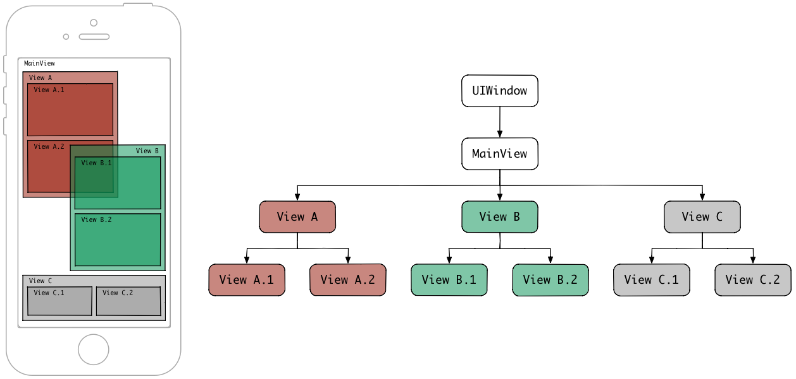

#UIKit

UIKit е най-често използваната библиотека при разработването на iOS приложения.Чрез нея може да се построи и управлява графичния интерфейс на приложението,който е базиран на събития,които могат да бъдат предизвикани от потребителя,нотификации,операционната система и др.Тя съдържа основните компоненти на приложението като визуални елементи.Текстови визуализации, бутони,таблици,колекции,системни навигации и други.

Както Foundation библиотеката дефинира класове,протоколи и функции за различните платформи,така UIKit дефинира визуалните компоненти и основи за едно приложение.
UIKit също дефинира класове,протоколи,функции,типове данни и константи.Тя добавя и допълнителен слой към Foundation класовете.

UIKit предоставя необходимата инфраструктура за приложенията.Визуалните компоненти,обработването на събитията свързани с действия изпълнени по екрана и постоянния цикъл,който се грижи за връзките между потребителя, операционната система и приложението.

Библиотеката също така поддържа обработката на анимации,документи,рисуване и принтиране,съдържа информация за текущото устройство,управлението на текстове и визуализацията им,управление на ресурсите и др.

Изключително важно е модификациите на интерфейса на приложението да се изпълняват само върху главната нишка на приложението. Вижте [защо][25] и [как][24].

Всеки клас,който принадлежи към библиотеката започва с префикса UI.
Cocoa Touch и UIKit стъпват основно на MVC(Model View Controller) шаблона,който е един от разпространените шаблони в обектно ориентираното програмиране.
В MVC, модела (Model) е под контрол на бизнес логиката на приложението,негова отговорност е комуникацията с базата данни например.
Възуалния слой (View) визуализира данните представени от модела на потребителя и също така управлява потребителския интерфейс и обработва действията на потребителя.
Контролера е връзката между визуалния слой и модела. Докато визуалния слой и модела обикновено не си комуникират помежду си, контролера комуникира и с двата.
Поради тази причина, визуалния слой (UIKit) е лесно преизползваем,т.к. не е зависим от модела и от контролера.

UIApplication - При стартирането на едно iOS приложениe се създава една единствена инстанция от този клас(singleton) и остава единствена докато приложението е в паметта. Инстанцията на този клас е началната точка за всички действия на потребителя и тя изпраща събитията към съответните обекти, които са регистрирани да следят за конкретно събитие.
UIApplication има обект делегат в приложението, който се създава заедно със създаването на iOS проекта и той се нарича AppDelegate.

UIKit дефинира UIView класа, който обикновено е отговорен за визуализирането на съдържанието върху екрана. UIApplication управлява main event loop на приложението и жизнените му функции по време на изпълнението му.

##Структура на приложението
UIKit управлява връзката на приложението със системата и предоставя класове с които да управлявате данните и ресурсите му.

*  [Core app][1]
*  [Resource Management][2]
*  [App Extensions][3]

##Потребителски интерфейс
View обектите Ви помагат да визуализирате съдържанието на екрана и улесняват действията на потребителя. View Controller-ите Ви помагат да управлявате View-тата и структурата на интерфейса.

*  [Views and controls][4] 
*  [View Controllers][5]
*  [View Layout][6]
*  [Animation and Haptics][7]
*  [Windows and Screens][8]

###View
####1.Свойства на View-то

1.Изобразяване и подсписъка от наследници

* Дефинира размера си спрямо View родителя си. 
* Управлява списъка от View децата си.
* Може да променя позицията и размера на децата си.
* Може да конвертира точки от координатната си система към такава на други View обекти или на главния екран.

2.Рисуване и анимации

* Рисува съдържанието си в правоъгълната си форма.
* Някой свойства на View-то могат да бъдат анимирани.

3.Обработка на събития

* Може да приема натисканията по екрана от потребителя.
* Може да участва в responder chain.
 
####2.Йерархия

####3.Елементи

* alpha, hidden, opaque
* bounds, frame, center, transform
* autoresizingMask, autoresizesSubviews
* contentMode, contentStretch, contentScaleFactor
* gestureRecognizers, userInteractionEnabled, multipleTouchEnabled, exclusiveTouch
* backgroundColor, subviews, drawRect: method, layer, (layerClass method)

##User Interactions
Responders (UIResponder) и Gesture Recognizers Ви помагат да обработвате докосвания,жестове,клавиатурни входове и други събития. Можете да използвате Drag and Drop,Peek and pop и accessibility за да обработите други типове действия на потребителя.

*  [Touch,Press,Gesture][9]
*  [Drag and Drop][10]
*  [Focus Interactions][11]
*  [Peek and Pop][12]
*  [Keyboard and Menus][13]
*  [Accessibility][14]

##Графика,рисуване и принтиране
UIKit предоставя класове и протоколи,с които да конфигурирате средата на чертане и да визуализирате съдържанието си.

*  [Images and PDF][15]
*  [Drawing][16]
*  [Printing][17]

##Текст
В допълнение към текстовите View обекти, които улесняват визуализацията на текст в приложението Ви,UIKit предоставя възможност за модифициране на текста и визуализацията му.

*  [Text display and Fonts][18]
*  [Text Storage][19]
*  [Keyboards and Input][20]

##Референции и полезни връзки
* [UIKit константи][21]
* [UIKit функции][22]
* [UIKit типове данни][23]
* [Human Interface Guidelines][26]
* [More about Windows and Views][27]
* [Responder Chain][28]

[1]: https://developer.apple.com/documentation/uikit/core_app
[2]: https://developer.apple.com/documentation/uikit/resource_management
[3]: https://developer.apple.com/documentation/uikit/app_extensions
[4]: https://developer.apple.com/documentation/uikit/views_and_controls
[5]: https://developer.apple.com/documentation/uikit/view_controllers
[6]: https://developer.apple.com/documentation/uikit/view_layout
[7]: https://developer.apple.com/documentation/uikit/animation_and_haptics
[8]: https://developer.apple.com/documentation/uikit/windows_and_screens
[9]: https://developer.apple.com/documentation/uikit/touches_presses_and_gestures
[10]: https://developer.apple.com/documentation/uikit/drag_and_drop
[11]: https://developer.apple.com/documentation/uikit/focus_interactions
[12]: https://developer.apple.com/documentation/uikit/peek_and_pop
[13]: https://developer.apple.com/documentation/uikit/keyboard_and_menus
[14]: https://developer.apple.com/documentation/uikit/accessibility

[15]: https://developer.apple.com/documentation/uikit/images_and_pdf
[16]: https://developer.apple.com/documentation/uikit/drawing
[17]: https://developer.apple.com/documentation/uikit/printing

[18]: https://developer.apple.com/documentation/uikit/text_display_and_fonts
[19]: https://developer.apple.com/documentation/uikit/text_storage
[20]: https://developer.apple.com/documentation/uikit/keyboards_and_input

[21]: https://developer.apple.com/documentation/uikit/uikit_constants
[22]: https://developer.apple.com/documentation/uikit/uikit_functions
[23]: https://developer.apple.com/documentation/uikit/uikit_data_types
[24]: https://developer.apple.com/documentation/code_diagnostics/main_thread_checker
[25]: https://www.quora.com/Why-must-the-UI-always-be-updated-on-Main-Thread
[26]: https://developer.apple.com/design/human-interface-guidelines/
[27]: https://developer.apple.com/library/archive/documentation/WindowsViews/Conceptual/ViewPG_iPhoneOS/WindowsandViews/WindowsandViews.html
[28]: https://developer.apple.com/documentation/uikit/touches_presses_and_gestures/using_responders_and_the_responder_chain_to_handle_events