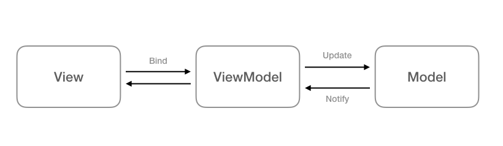

# Шаблони за дизайн

Това са:

### Преизползваеми решения в обектно ориентираното програмиране при дизайна на софтуер.
* Правят кода по-лесен за разчитане и преизползваем.
* Създават **loosely coupled** (свободно свързан) код - лесно можем да подменяме и добавяме части, без регресии.

Те са:

* Структурни/Structural - Delegation, Cmposite, Decorator
* Създаващи/Creational - Dependency injection, Singleton, Factory, Prototype
* Поведенчески/Behavioral - Chain of responsibility, Memento, Observer, Protocol stack, Visitor
* Архитектурни/Architectural - MVC, MVVM, MVP, MVA, Client-Server
* Функционални*/Functional* - Closure, Currying, Functor, Monad

Повече информация за шаблоните може да намерите на следния [сайт]().

# MVC
* Model-View-Controller
* Архитектурен шаблон
* В основата на Cocoa и UIKit

### Разделяме данните, бизнес логиката и графичния интерфейс

## Модел - Model
* "Какво"-то на приложението
* Ядрото
* Данните
* **Абсолютно** НЕЗАВИСИМ от потребителския интерфейс

## Контролер - Controller
* Медиатор между модела и потребителския интерфейс
* Интерпретира, форматира и подготвя данните за визуализация
* Манипулира данните от Модела
* "Как" на приложението

## Изглед - View
* Потребителският интерфейс - подредба на визуалните елементи, анимации и др. 
* Подчинен на *Контролера*
* Елементите са абстрактни, нямат си представа с какви данни работят

# Правила/посоки/канали за комуникация между Модел-Изглед-Контролер

### Контролер -> Модел
* Неограничена комуникация
* Неговата задача е да представи данните от модела

### Контролер -> Изглед
* IBOutlet променливи за отделните елементи
* Предаваме на Изгледа какво и как да го покаже

### Изглед <-> Модел е *ЗАБРАНЕНА*
* Моделът е НАПЪЛНО независим от потребителкия интерфейс
* Изгледа Е потребителския интерфейс

### Изглед -> Контролер
* "Сляпа и структурирана" комуникация, Изгледа е абстрактен
* IBAction (Target-action)
* При нужда от синхронизация между Изгледа и Контролера - делегираме (напр. UIScrollViewDelegate)
* Изгледа не притежава данните, затова - питаме за тях Контролера, които трябва да представим - dataSource (напр. UITableViewDataSource)
* Delegate и DataSource се реализират с Протоколи

### Модел -> Контролер
* Няма директна комуникация
* При промяна в данните, Моделът може да уведоми Контролера чрез нотификация и той ги поисква от Модела
* Може да се разгледа като "радио предаване" - Модела предава, Контролера слуша

### MVC отговаря за един екран, но в едно по-голямо приложение имаме повече от едно MVC и те си общуват по позволените канали за комуникация.

# MVVM
* Model-View-ViewModel (-Binding*)
* Архитектурен шаблон
* [Джон Госман 2005](https://blogs.msdn.microsoft.com/johngossman/2005/10/08/introduction-to-modelviewviewmodel-pattern-for-building-wpf-apps), Майкрософт, WPF

### Изместваме състоянието и управлението му от View-то към ViewModel

## Изглед - View
* Потребителският интерфейс - подредба на визуалните елементи, инициализацията им, анимации и др.

## ViewModel
* Слой между Изгледа и Модела
* Предоставя набор от интерфейси, всеки от които представлява визуален компонент от Изгледа
* Използваме Обвързване (Binding), за да свържем визуалните компоненти с тези интерфейси
* т.е. **НЕ** достъпваме Изгледа директно, а при промени от бизнес логиката, Изгледа сам се обновява
* Обработката и форматирането на данните, която се случваше в Контролера при MVC, е задача на ViewModel

### Предимства
* Енкапсулираната логика във ViewModel позволява по-лесното изолирано тестване

### Недостатъци
* Самият Джон Госман  изтъква, че времето за имплементация и усилията са "излишни" за прости операции с потребителския интерфейс.
* За по-големи приложения става по-трудно генерализирането на ViewModel и е възможно използването на значително повече памет

# Delegation

Делегирането е начин на композиция, също толкова добра за преизползването на код, както и Наследяването.
При делегирането в обработката на заявка участват два обекта: приемащият обект делегира операции на своя **делегат**. 
Това е аналогично на наследниците, използващи имплементацията на функционалност на бащиния клас.
