# UITableView
--

## Съдържание  

### 0. Предварително нужни знания (преговор) 

### 1. Терминология и видове UITableView  

### 2. Как да използваме UITableView?  

### 3. IndexPath  

### 4. UITableViewDataSource  

### 5. UITableViewDelegate  

### 6. UITableViewCell  


## Предварително нужни знания  

#### 1. Протоколи

#### 2. Design pattern-и (по-конкретно Delegate, MVC)

#### 3. UIView

## Какво е [UITableView](https://developer.apple.com/documentation/uikit/uitableview)?

```swift
class UITableView : UIScrollView
```  

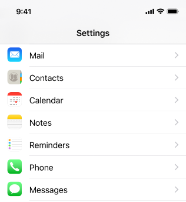

`UITableView` или казано по друг начин таблиците са един от най-важните компоненти в iOS приложенията. Използват се за визуализиране на списък от елементи, които могат да бъдат скролирани, като по този начин ни позволяват да покажем по-голямо количество информация от колкото се побира на екрана на устройството.

### Елементи на `UITableView`
- `Rows` - редове. Всеки ред на таблицата изобразява част от съдържанието на приложението ни. 
- `Sections` - секции. Помагат ни да групираме редовете на таблицата  смислово, като по този начин улесняваме работата на потребителя.
- `Headers` - хедъри. Те биват два вида - `table view header` и `section header`. `Table view header` винаги се вижда в горната част на таблицата, а `section header` за конкретна секция е видим докато съдържанието на секцията е видимо, след което бива заменен с `section header`-а на следващата секция.
- `Footers` - футъри. Аналогично на `Headers` те биват `table view footer` и `section footer`, единствената разлика е че вместо да се намира в горната част на таблицата и в началото на секцията, `footer`-ите стоят съответно в долната част на таблицата и в края на секцията.

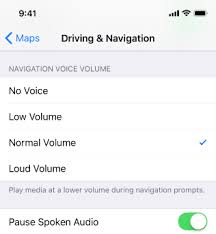

Прикрепването на хедърите/футърите към началото/края на дадена секция на таблицата се нарича `sticky header/footer` поведение, като то ни е предоставено наготово от iOS.

Всяка таблица задължително има редове, останалите елементи не са задължителни, като ако не укажем изрично броя на секциите по подразбиране ще имаме само една.

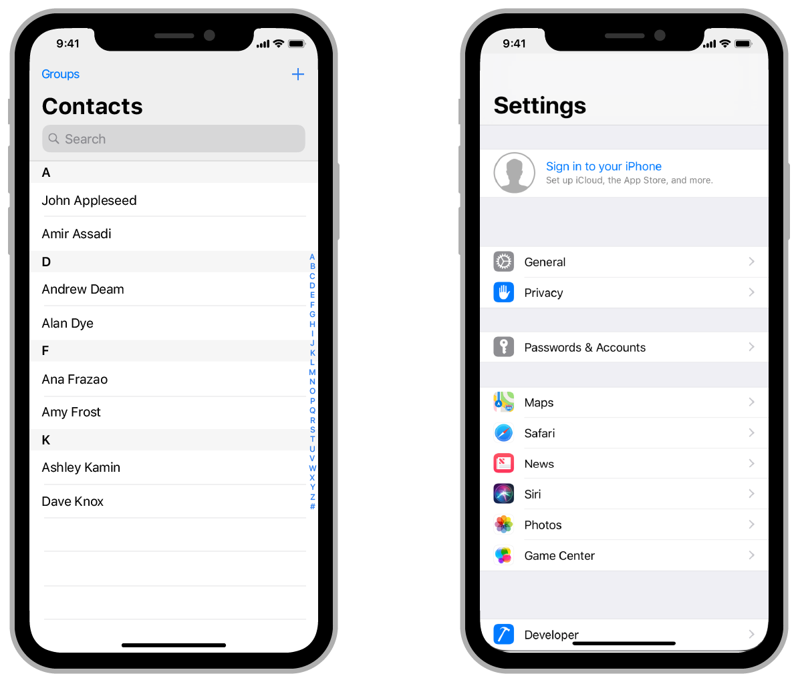  

## Видове `UITableView`
### Според **съдържанието** си таблиците са два вида:

#### 1. `Статични (Static cells)` 
- Таблици, в които предварително знаем какво ще бъде съдържанието на всяка клетка, например в `Settings` приложението. При този тип таблици директно попълваме данните в Storyboard-а на приложението ни, като е важно да отбележим, че можем да използваме `статична` таблица само в `UITableViewController`   
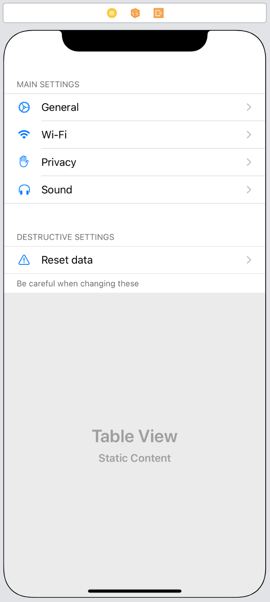 

#### 2. `Динамични (Dynamic properties)` 
- Таблици, в които знаем как ще изглеждат редовете, но не знаем какво ще бъде съдържанието им. В този случай използваме така наречените `клетки прототипи`, като на всеки такъв прототип трябва да дадем уникален идентификатор за да можем да го инстанцираме чрез метода `dequeueReusableCell(withIdentifier:)`.  
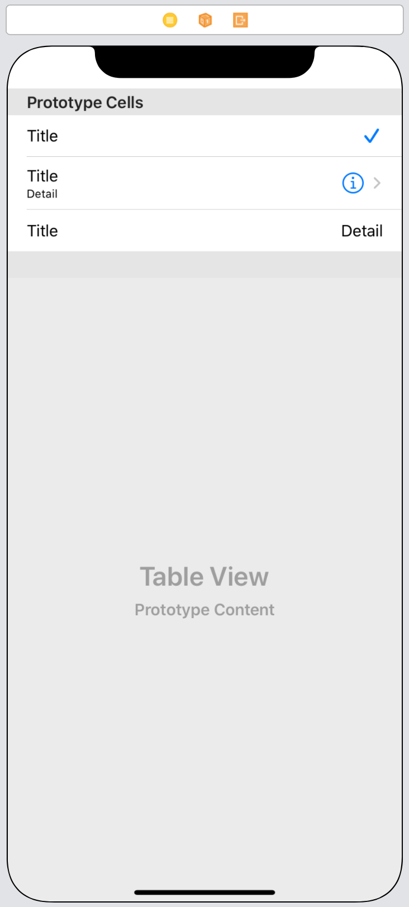 

### Според **представянето** си таблиците са три вида:

#### 1. `Обикновени(Plain)` 
- Хедърите и футърите на таблицата изглеждат като разделители между секциите и са подравнени с клетките.  
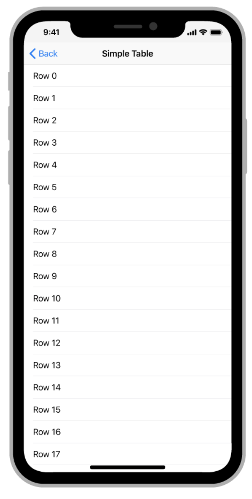  


#### 2. `Групирани(grouped)` 
- Помежду секциите има разстояние (padding).  
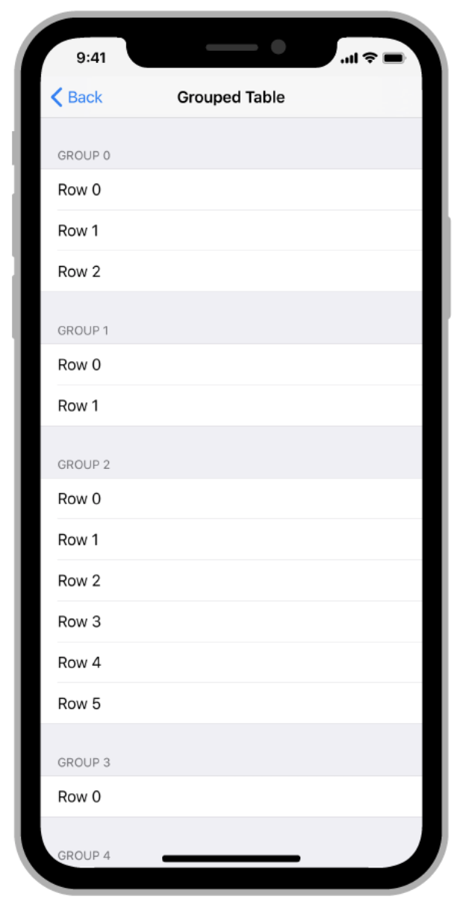  

#### 3. `Вложено групирани(Inset grouped)` 
- Подобно на групираните таблици, вложено групираните също имат разстояние между секциите, но разликата е че съдържанието е отместено навътре.   
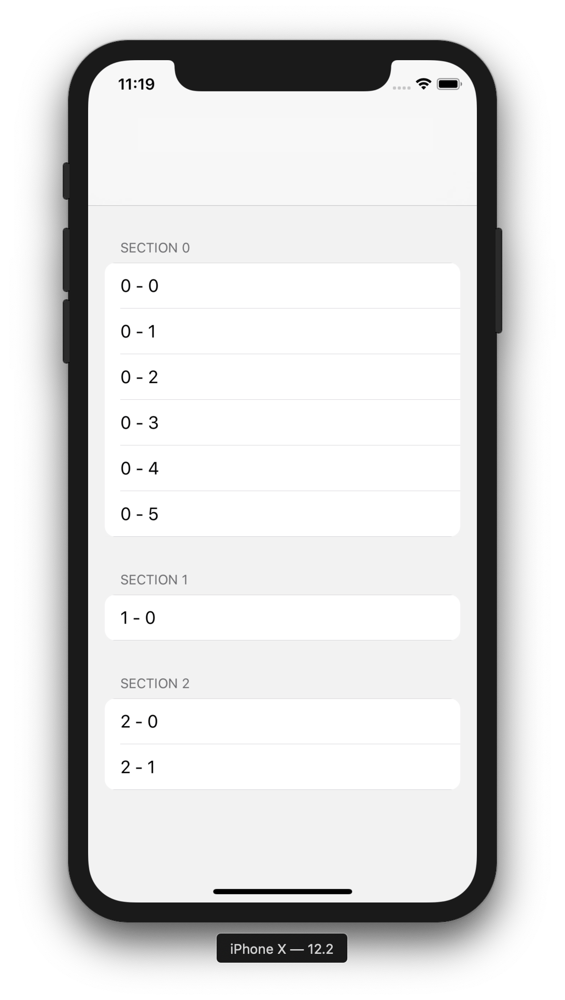

## Как да използваме `UITableView`?
Най-лесния начин да добавите table view към вашия интерфейс е като добавите `UITableViewController` обект във вашия storyboard. Xcode автоматично създава нова сцена съдържаща `UIViewController`, в който има `UITableView`, които ние можем да конфирурираме и използваме. При промяна на данните винаги трябва да викаме метода `reloadData()` на `UITableView`.

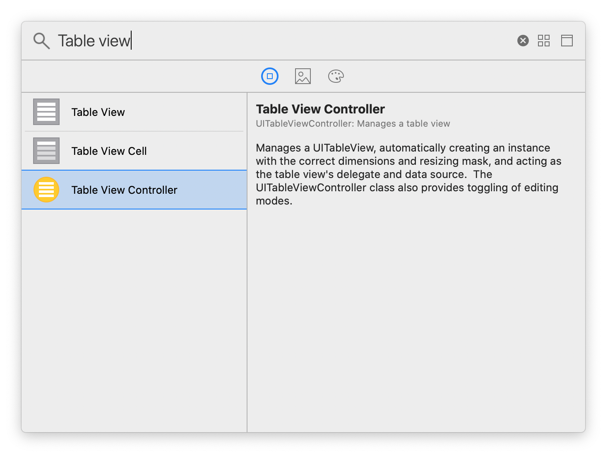

### Как да осигурим данните на `UITableView`?
`UIViewController` класа, който съдържа `UITableView` трябва да имплементират два протокола - `UITableViewDataSource` и `UITableViewDelegate`, но преди да се запознаем с тях трябва да знаем какво е `IndexPath`.

### [IndexPath](https://developer.apple.com/documentation/foundation/indexpath)
```swift
struct IndexPath
```
`IndexPath` представлява списък от индекси, които заедно образуват път до конкретна позиция в дървовидна структура от вложени масиви.  
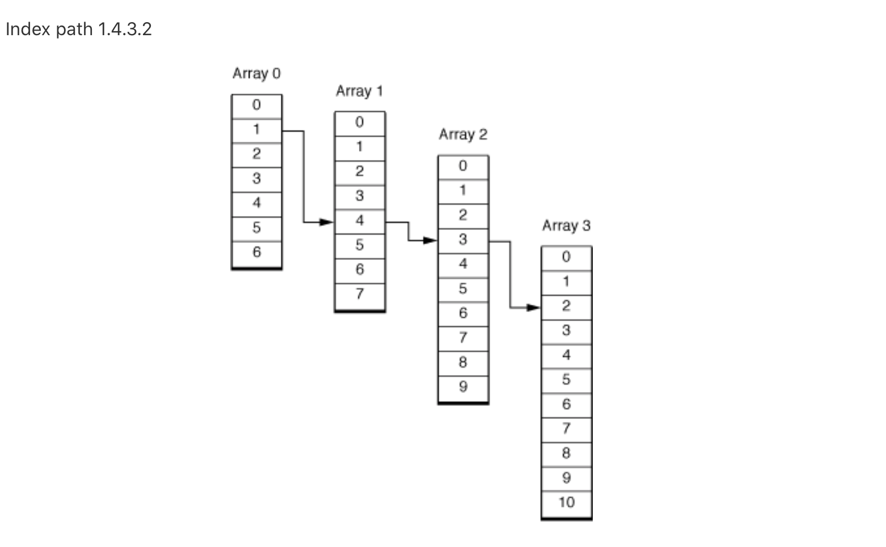

При таблиците използваме `IndexPath` за да укажем пътя до конкретен елемент на таблицата, посредством неговия ред и секция. Най-често ще ни се налага да използваме следния инициализатор:

```swift
IndexPath(row: Int, section: Int)
```

Например `index path`-а на първия ред на таблица е `IndexPath(row: 0, section: 0)`, докато този на осмия ред в четвъртата секция е `IndexPath(row: 7, section: 3)`. 

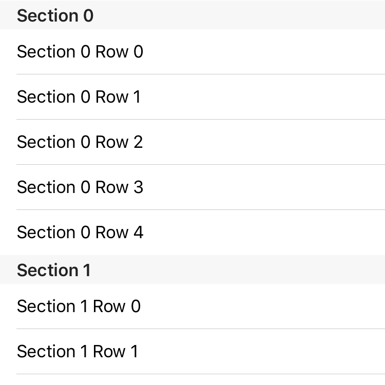  

## [UITableViewDataSource](https://developer.apple.com/documentation/uikit/uitableviewdatasource)
```swift
weak var dataSource: UITableViewDataSource? { get set }
```
Всеки клас, който имплементира този протокол, имплементира няколко задължителни метода, които осигуряват на таблицата нужните данни за да се изгради. Чрез методите на `UITableViewDataSource`, контролера дава следната информация на таблицата при първото показване и след всяко извикване на `reloadData()`:  

- Колко реда да има в таблицата? **(задължително)**
- Кой да бъде `UITableViewCell` обекта за всеки конкретен ред от таблицата? **(задължително)**
- Колко на брой да бъдат секциите? **(по избор, стойността по подразбиране е 1)**  

-- 
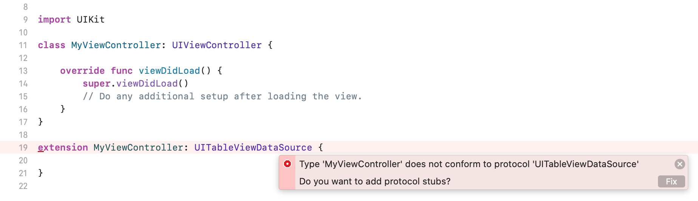  
-- 
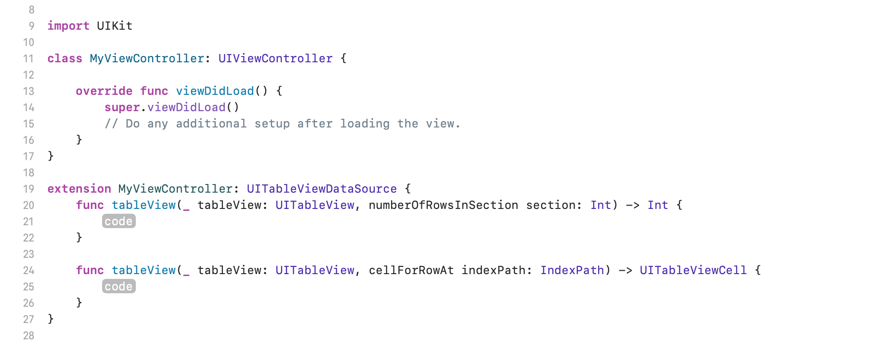
-- 
```swift
public protocol UITableViewDataSource : NSObjectProtocol {

    @available(iOS 2.0, *)
    func tableView(_ tableView: UITableView, numberOfRowsInSection section: Int) -> Int

    @available(iOS 2.0, *)
    func tableView(_ tableView: UITableView, cellForRowAt indexPath: IndexPath) -> UITableViewCell
    
    @available(iOS 2.0, *)
    optional func numberOfSections(in tableView: UITableView) -> Int

    @available(iOS 2.0, *)
    optional func tableView(_ tableView: UITableView, titleForHeaderInSection section: Int) -> String?
    
    @available(iOS 2.0, *)
    optional func tableView(_ tableView: UITableView, titleForFooterInSection section: Int) -> String?

    @available(iOS 2.0, *)
    optional func tableView(_ tableView: UITableView, canEditRowAt indexPath: IndexPath) -> Bool

    @available(iOS 2.0, *)
    optional func tableView(_ tableView: UITableView, canMoveRowAt indexPath: IndexPath) -> Bool

    @available(iOS 2.0, *)
    optional func sectionIndexTitles(for tableView: UITableView) -> [String]?

    @available(iOS 2.0, *)
    optional func tableView(_ tableView: UITableView, sectionForSectionIndexTitle title: String, at index: Int) -> Int
    
    @available(iOS 2.0, *)
    optional func tableView(_ tableView: UITableView, commit editingStyle: UITableViewCell.EditingStyle, forRowAt indexPath: IndexPath)
    
    @available(iOS 2.0, *)
    optional func tableView(_ tableView: UITableView, moveRowAt sourceIndexPath: IndexPath, to destinationIndexPath: IndexPath)
}
```

## [UITableViewDelegate](https://developer.apple.com/documentation/uikit/uitableviewdelegate)  
```swift
weak var delegate: UITableViewDelegate? { get set }
```
Таблиците имат референция към обект наречен `delegate` (делегат), който управлява селекцията, конфигурира пояснителните клетки под и над секциите `section header` и `section footer`, помага за изтриването и пренареждането на клетките и много други. Всички методи от протокола `UITableViewDelegate` са `optional`. Някои от често използваните методи са следните:

```swift
public protocol UITableViewDelegate : UIScrollViewDelegate {

    @available(iOS 2.0, *)
    optional func tableView(_ tableView: UITableView, willDisplay cell: UITableViewCell, forRowAt indexPath: IndexPath)
    
    @available(iOS 6.0, *)
    optional func tableView(_ tableView: UITableView, didEndDisplaying cell: UITableViewCell, forRowAt indexPath: IndexPath)
    
    ...
    
    @available(iOS 2.0, *)
    optional func tableView(_ tableView: UITableView, heightForRowAt indexPath: IndexPath) -> CGFloat
    
    @available(iOS 2.0, *)
    optional func tableView(_ tableView: UITableView, heightForHeaderInSection section: Int) -> CGFloat

    @available(iOS 2.0, *)
    optional func tableView(_ tableView: UITableView, heightForFooterInSection section: Int) -> CGFloat
    
    ...
    
    
    @available(iOS 7.0, *)
    optional func tableView(_ tableView: UITableView, estimatedHeightForRowAt indexPath: IndexPath) -> CGFloat
    
    @available(iOS 7.0, *)
    optional func tableView(_ tableView: UITableView, estimatedHeightForHeaderInSection section: Int) -> CGFloat

    @available(iOS 7.0, *)
    optional func tableView(_ tableView: UITableView, estimatedHeightForFooterInSection section: Int) -> CGFloat

    
    ...
    
    @available(iOS 2.0, *)
    optional func tableView(_ tableView: UITableView, viewForHeaderInSection section: Int) -> UIView?

    @available(iOS 2.0, *)
    optional func tableView(_ tableView: UITableView, viewForFooterInSection section: Int) -> UIView?
    
	...
	
	@available(iOS 2.0, *)
    optional func tableView(_ tableView: UITableView, didSelectRowAt indexPath: IndexPath)

    @available(iOS 3.0, *)
    optional func tableView(_ tableView: UITableView, didDeselectRowAt indexPath: IndexPath)
    
    ...
    
}
```  

## [UITableViewCell](https://developer.apple.com/documentation/uikit/uitableviewcell)
```class UITableViewCell : UIView```

`UITableViewCell` е специализиран обект, наследник на `UIView`, който ни позволява да изобразим данните на един ред от таблиците в приложението ни. Всяка таблица преизползва клетките си посредством уникалните идентифицатори, които трябва да дадем на клеткитe. Когато се извика метода `tableView(_:cellForRowAt:)` използваме `dequeueReusableCell(withIdentifier:)` за да инстанцираме обект от тип `UITableViewCell`, преизползвайки клетките, които вече не са видими на екрана (при скролиране).

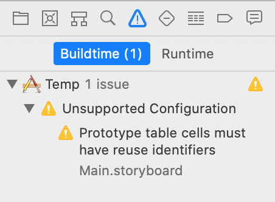

`UITableViewCell` съдържа обект от тип `UIView` наречен `contentView`, който представлява superview на цялото съдържание, което ще добавим в клетката и към който свързваме необходимите `constraint`-и.
Освен това`UITableViewCell` съдържа поле от тип `enum` (изброен тип) - `UITableViewCell.CellStyle`, който съдържа четирите стандартни вида клетки, които можем да използваме наготово:

1. `default` - Най-семпъл дизайн с `UILabel` и `optional`(по избор) `UIImageView`.
2. `value1` (Right detail) - Ляво подравнен `UILabel` от лявата страна на клетката, дясно подравнен `UILabel` от дясната страна на клетката. `Settings` приложението използва този тип клетки.
3. `value2` (Left detail) - Дясно подравнен `UILabel` от лявата страна на клетката, от дясната страната на този лейбъл стои още един `UILabel`, който е ляво подравнен и с по-малък текст.
4. `subtitle` - Два ляво подравнени `UILabel`-а от лявата страна на клетката, които са разположени един под друг, долния от които е с по-малък сив (пояснителен) текст. 

Когато работим със стандартните стилове клетки използваме следните полета на `UITableViewCell` за да представяме нашите данни:

```swift
var textLabel: UILabel? { get }
var detailTextLabel: UILabel? { get }
var imageView: UIImageView? { get }
```


Освен четирите стандартни стила, както доста често се налага, можем да създаваме `custom` (персонализирани) клетки. Начина да направим това е да създадем нов Cocoa Touch клас, който е наследник на `UITableViewCell`, например:

```swift
class MyTableViewCell: UITableViewCell { ... }
```

Можем да персонализираме клетката по същия начин както всички останали наследници на `UIView` и след това да я използваме като елемент на таблицата.


# Collection View


Управлява и представя подредена колекция от елементи.
Когато добавите UICollectionView към приложението си, основната ви отговорност е да обработвате и предоставята данните,които ще се визуализират от UICollectionView обекта.
Подобно на UITableView за това се грижи [dataSource][12] обекта,който добавите към колекцията си. Съответно този обект трябва да имплементира [UICollectioViewDataSource][10] протокола. 
```swift
protocol UICollectioViewDataSource
```
Подобно на клетките при таблиците, при колекциите имаме единичен елемент(item),които могат да бъдат групирани в отделни секции.
За презентиране на отделните елементи в колекциите се използва [UICollectionViewCell][13] обекта.Можем да използваме както системните,така и наши собствени имплементации на обекта.
Също като при таблиците и при колекциите имаме допълнително визуални елементи,които да предоставят или визуализират различна информация за клетките в отделните секции или колекции като цяло.
Тези допълнителни елементи се упвляват от [UIColletionViewLayout][8] обекта.
Отново за добавянето,изтриването и пренареждането на клетките се грижи dataSouce обекта на колекцията,а за избраните елементи се грижи [delegate][11] обекта на колекцията,който имплементира [UIColletionViewDelegate][9] протокола.

```swift
protocol UIColletionViewDelegate
```		
UICollectionViewLayout обекта е отговорен за организацията и позицията на всички клетки и допълнителни view-та на колекцията.


## Елементи

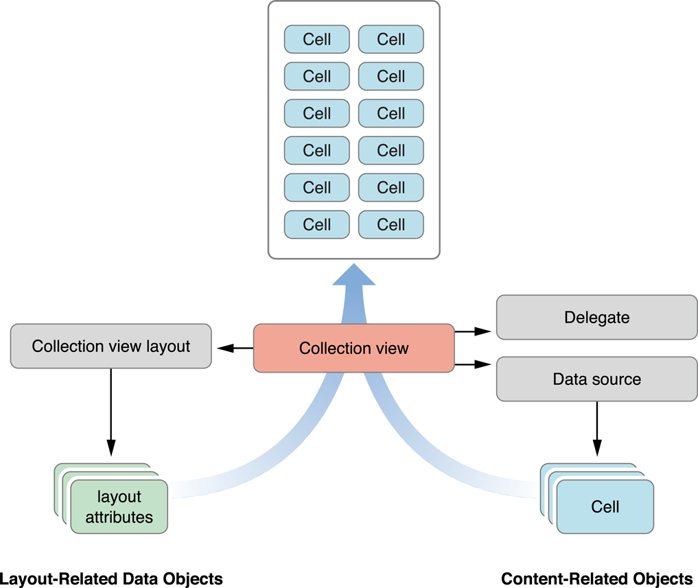


#### Основен компонент - [UICollectionView][14]
Основния елемент,в който ще се визуализира цялото съдържание подобно на `UITableView`. Също като `UITableView`, `UICollectionView` наследява `UIScrollView`.


#### Клетки - [UICollectionViewCell][13]
Подобно на `UITableViewCell` в таблиците. Тези клетки изграждат и визуализират основното съдържание в колекцията.Също като при таблиците,клетките на една колекция могат да бъдат създавани в кода или през `Interface Builder`.


#### View-та за допълнителна информация - Supplementary Views 
Използват се за допълнителна информация към секциите на колекцията.


#### [Delegate][11] 

* [UIColletionViewDelegate][9] 


#### [Datasource][12]

* [UICollectioViewDataSource][10] 

#### Setup

1. Добавете `UICollectioView` към view йерархията нa приложението.
2. Изберете класа, който да бъде `delegate` и `dataSource` и отбележете,че имплементира `UICollectionViewDataSource` и `UICollectionViewDelegate`.
3. Добавете този клас като `delegate` и `dataSource` на колекцията.
4. Добавете инстанция на `UICollectionView` към желания `ViewController`.
5. Ако искате да използвате различни от системните клетки създайте нов клас,който наследява `UICollectionViewCell`.
6. Ако стройте layout-та си в Interface Builder,добавете на клетката си новия клас,който създадохте и идентификатор за преизползване.
7. Добавете view елементи към клетката в зависимост от съдържанието и дизайна.
8. Добавете референции към view елементите на клетката в класа,който създадохте за нея.
9. Определете модела,който ще се използва за популирането на колекцията.
10. При необходимост добавете API за зареждане на данни в модела.
11. При необходимост добавете DataSource клас,който да се грижи за заявките и да съхранява получените от тях данни.
12. Имплементирайте необходимите методи от UICollectionViewDelegate и UICollectionViewDataSource протоколите.
13. Заредете данните в класа,който имплементира двата протокола.
14. Нагласете визуалното разположение на елементите на колекцията.
15. Презаредете данните.

#### Update

* Data update - reloadData()
* Layout update - invalidateLayout()

#### Customize

* Custom cells

## Референции и полезни връзки

* [Tables Human Interface Guidelines][20]
* [Collections Human Interface Guidelines][21] 


[1]: https://developer.apple.com/documentation/uikit/uitableviewdelegate
[2]: https://developer.apple.com/documentation/uikit/uitableviewdatasource
[3]: https://developer.apple.com/documentation/uikit/uitableview/1614894-delegate
[4]: https://developer.apple.com/documentation/uikit/uitableview/1614955-datasource
[5]: https://developer.apple.com/documentation/foundation/nsindexpath
[6]: https://developer.apple.com/documentation/uikit/uitableviewcell
[7]: https://developer.apple.com/documentation/foundation/indexpath
[8]: https://developer.apple.com/documentation/uikit/uicollectionviewlayout
[9]:  https://developer.apple.com/documentation/uikit/uicollectionviewdelegate
[10]:https://developer.apple.com/documentation/uikit/uicollectionviewdatasource
[11]: https://developer.apple.com/documentation/uikit/uicollectionview/1618033-delegate
[12]: https://developer.apple.com/documentation/uikit/uicollectionview/1618091-datasource
[13]: https://developer.apple.com/documentation/uikit/uicollectionviewcell
[14]: https://developer.apple.com/documentation/uikit/uicollectionview


[20]: https://developer.apple.com/design/human-interface-guidelines/ios/views/tables/
[21]: https://developer.apple.com/design/human-interface-guidelines/ios/views/collections/
