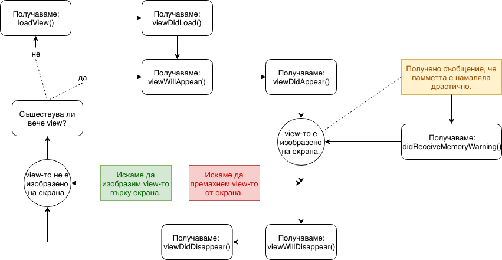

# Жизнен цикъл на UIViewController

В тази лекция ще разгледаме жизненият цъкъл на един `UIViewController` или за по кратко `view`-контролер.

### init(coder:)
Обикновено контролерите биват създадени от Interface Builder-a в UIStoryboard. Инициализаторът, който се извиква в този случай е `init(coder:)`.

Той предоставя инстанция на NSCoder като параметър, който ви е необходим само, ако използвате сериализация. Сериализацията трансформира обекта в байтов поток, който можете да запишете на устройството или да го изпратите по мрежата.

#### Приложение:
По време на инициализацията на view контролера, обикновено разпределяте ресурсите, които ще трябват на контролерът по време на жизненият му цикъл. Те включват константи, променливи, модели или други помощни контролери.

#### Важно:
Обърнете внимание, че при извикването на `init` методите view-то все още не е създадено. Ако се опитате да го досъпите в този момент, ще бъде автоматично извикан методът `loadView()`. Това може да доведе до неочаквано поведение и грешки, затова е по-безопасно да извикате view-то в по-късен етап от жизнения цикъл.

### init(nibName:bundle:)

Ако създадете view контролер от nib файл, този инициализатор ще бъде извикан вместо `init(coder:)`.

Понякога може да ви се наложи да поставите view-то в отделен nib файл, вместо в `UIStoryboard`. Например ако сте част от по-голям екип, където различните членове им се налага да правят чести промени по интерфейса на контролери, без да засяга работата на останалите.
Имайте предвид че ако `UIStoryboard` стане твърде голям можете да го разделите на няколко по-малки. Не е нужно да създавате отделни nib файлове за всеки контролер.

### loadView()

Това е методът, който създава view-то na view контролера. Можете да направите `override` на този метод само в случай, че искате да изградите целия интерфейс програмно. Не използвайте метода, освен ако няма основателна причина.

Ако използвате `UIStoryboard` или nib файл, не е нужно да правите нищо с този метод и можете да го игнорирате. Неговата имплементация в бащиният `UIViewController` зарежда интерфейса на view-то от интерфейс файла *(.storyboard, .xib)* и свързва всичките му `IBOutlets` и `IBActions` вместо вас.

### viewDidLoad()

Когато този метод бъде извикан, изгледът на контролера за изгледа е създаден и сте сигурни, че всички изходи са на мястото си.

#### Приложение:
Обикновено този метод се използва за допълване на потребителският интерфейс с данни, преди потребителят да може да го види. Също така метода е подходящ да се започнат някои дейности на заден план *(background)*, за които Ви трябва интерфейс при края им. Често се серещат заявки към сървър, отговор на които са необходими само веднъж, при зареден екран. Също така методът е подходящ за инициализация и настройка на обекти, използвани в контролера.

#### Важно:
Този метод се извиква само веднъж в жизненият цикъл на контролера, затова го използвайте за дейности, които трябва да се случат само веднъж. Ако трябва да изпълнявате някаква задача всеки път, когато контролер се появи, използвайте някой от следващите методи.

Имайте предвид, че на този етап от жизненият цикъл размера и позициите на контролера и неговите елементи все още не са позиционирани и оразмерени финално.

### viewWillAppear(_:)

Този метод уведомява контролера, че неговото view е на път да се добави към йерархията. Можете да направите `override` на този метод, за задачи които ще се повтарят преди всяко показване на екрана.

#### Приложение:
Обикновено метода се използва, за актуализация на на данни впотребителския интерфейс, които може да са се променили, докато контролерът не е бил на екрана.
Можете също така да подготвите интерфейса за анимации, които искате да се задействат, когато екранът се появи, можете да проверите параметърът `animated`, който показва дали екранът ще бъде показан чрез анимация или не.

#### Важно:

В тази стъпка от жизненият цикъл елементите са позиционирани и оразмерени, но ориентацията все още не е приложена.

### viewWillLayoutSubviews()

Метода бива извикван за да уведому контролера, че неговото view започва да прави промени по изгледа на своите подразделения (subviews).

Метода се извиква всеки път, когато се промени позицията или размера на подразделенията, например при завъртане на устройството или бъде маркиран, чрез `setNeedsLayout()`. Това е първата стъпка от жизненият цъкъл, при която позицията и размера на view-то са финални. 

Ако не използвате autoresizing masks или auto layout *(constraints)* и размера на view-то се промени, най-вероятно искате да обновите подразделенията тук.

### viewDidLayoutSubviews()

Извиква се за да уведоми контролера, че промените по неговите подразделения са завършили. Тук можете да направите допълнителни промени, след като изгледа е оформен финално.

### viewDidAppear(_:)

Извиква се след като контролера се появи на екрана. Можете да използвате метода за да стартирате анимации, да започнете възпроизвеждане на видео или звук или да пуснете заявка към сървър.

### viewWillDisappear(_:)

Преди прехода към следващия контролер и преди предходния контролер да изчезне се извиква този метод. Рядко се налага да направите `override` на този метод, тъй като в този момент има малко задачи, които трябва да бъдат изпълнени, но може да се нуждаете от него.

### viewDidDisappear(_:)

След като контролерът бъде премахнат от екрана се извиква този метод. Обикновено се прави `override` на този метод, за да спрете задачи, които не трябва да бъдат изпълнявани, докато контролерът не е на екрана. Например, можете да спрете да слушате за нотификации, да следите за промени в променливи на други обекти, да спрете заявка към сървър или да спрете да следите сензори на устройството.

### deinit()

Подобно на всеки обект, преди контролерът да бъде премахнат от паметта, се деинициализира.

#### Приложение:

Обикновено се прави `override` на този метод, за да се почистят ресурси, които контролерът използва, но не са освободени от ARC. 

#### Важно:

Това че контролерът изчезва от екрана, не означава, че ще бъде деинициализиран, веднага след изчезването му. Много контролери, държат в себе си референция към други контролери. Например навигационният контролер държи референция към контролер, докато не изчезне от навигационната йерархия. Поради тази причина трябва да имате предвид, че контролерът, който вече не е на екрана, може да продължи да работи нормално и да получава нотификации. 

### didReceiveMemoryWarning()

Устройствата с операционна система на Apple имат ограничена памент, голяма част от устройствата имат само 1 гигабайт рам памет. Когато паметта започне да се запълва, устройството не започва да мести временната памет към твърдият диск, както правят повечето компютри. Поради тази причина Вие сте отговорни да намалите използваната памет от вашето приложение, когато устройството Ви уведоми чрез този метод.

