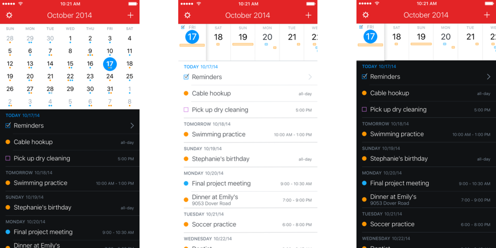

# Fitness App

Да се напише приложение за трениращи маняци, което показва календар на потребителя с неговите посещения в тренировъчната зала. Да бъдат обелязани минали и бъдещи (само 7 дни напред)тренировки на базата на историята на потребителя. Да може да се визуализира посещенията за последните 30 дни и една година.

Данните за потребител да се съхраняват във Firebase. Всеки потребител да има профил с негова снимка и лични данни - име, години, професия.

Да може лесно да се отбелязва посещение на фитнес и да се добавят снимки или записки към съответно посещение.

Да може да се friend-ва и un-friend-ва потребител. Тренировките на всеки "приятел" да се показват на календара.

Идеи за UI: 

Понеже приложението има нужда от профил и други важни фукционалностни е добре да се помисли дали няма да има нужда от tabbar.