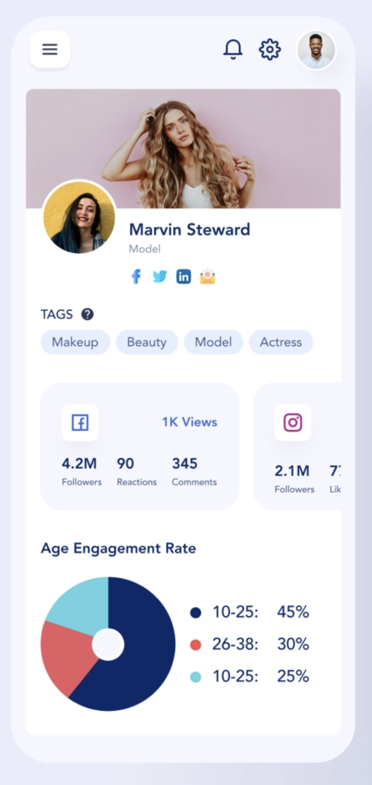

## Семинар 8 и 9 - SwiftUI

Изграждане на приложение със SwiftUI.

## Задача 1:
Да се реализира следния изглед с помощта на SwiftUI.


## Задача 2: 
Да се направи приложение, което изобразява списък с инфлуенсъри и при избиране на профил на определен инфлуенсър, да се отваря неговия профил от задача 1.

Примерни данни за инфлуенсърите може да намерите в ```files/influencers```.


-----
[design](https://dribbble.com/shots/13191060-Influencer-Dashboard-Responsive-UI-02)