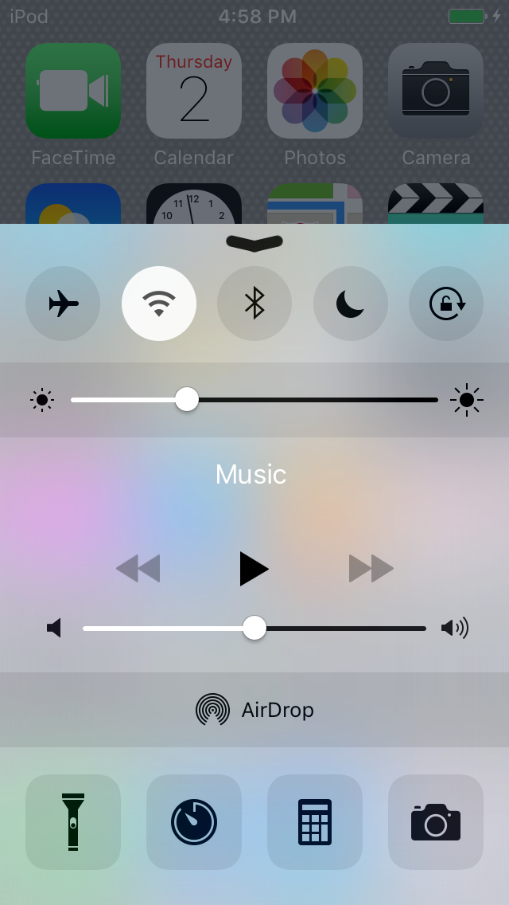

## Семинар 8 и 9 - SwiftUI

На следния път ```files/Autolayout``` ще намерите проект, който имитира външния вид на Control Center в iOS 10. Той е изработен така, че да изглежда добре само на iPhone 8 (и сходните резолюции) в портретен режим.

Ето и пример как изглежда на iOS 9 и iPhone 5/5S.



## Задача 1:
Да се реализира следния изглед с помощта на SwiftUI.


## Задача 2: 
Да се направи приложение, което изобразява списък с инфлуенсъри и при избиране на профил на определен инфлуенсър, да се отваря неговия профил от задача 1.

Примерни данни за инфлуенсърите може да намерите в ```files/influencers```.