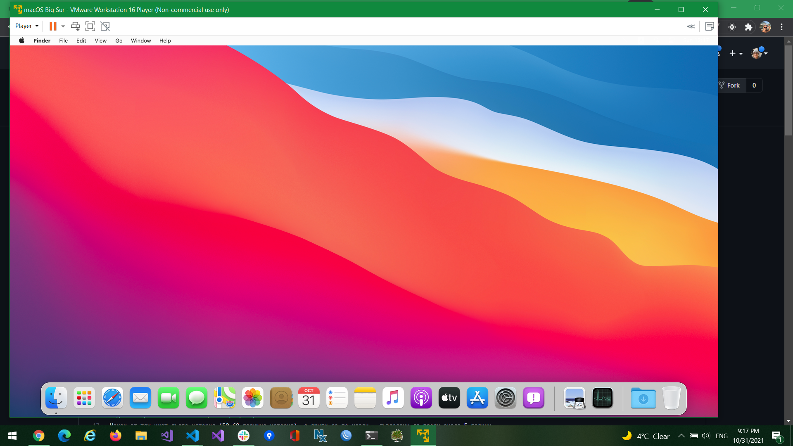

# Как да се справим с виртуалната машина на macOS Big Sur?

Трябва да свалите имиджа от [тук](https://www.sysprobs.com/macos-11-big-sur-vmware-image-vmdk-windows), като търсите линк към торент.

Трябва да инсталирате `VMware Workstation 16 Player` (това е безплатна версия за обучение. Можете да приемете такъв лиценз.)
Трябва да инсталирате auto-unlocker от [тук](https://github.com/paolo-projects/auto-unlocker/releases).
Той ще направи необходимите промени по VMWare.

Трябва да разархивирате архива свален в стъпка едно.

Трябва да спрете виртуализацията на компютъра `hyper-v` на компютрите с интел процесори. VMware ще мрънка, че не може да стартира виртуалната машина.
Ето полезен линк до който може да стигнете и сами [линк](https://docs.microsoft.com/en-us/troubleshoot/windows-client/application-management/virtualization-apps-not-work-with-hyper-v#:~:text=%20To%20disable%20Hyper-V%20in%20Control%20Panel%2C%20follow,clear%20the%20Hyper-V%20Hypervisor%20check%20box.%20See%20More).

Не забравяйте да рестартирате компютъра, за да се деактивира виртуализацията напълно.

След това стартирате виртуалната машина и чакате.

Ето снимка от моята инстанция.

Акаунта: `Sysprobs` и парола`sysprobs123`
